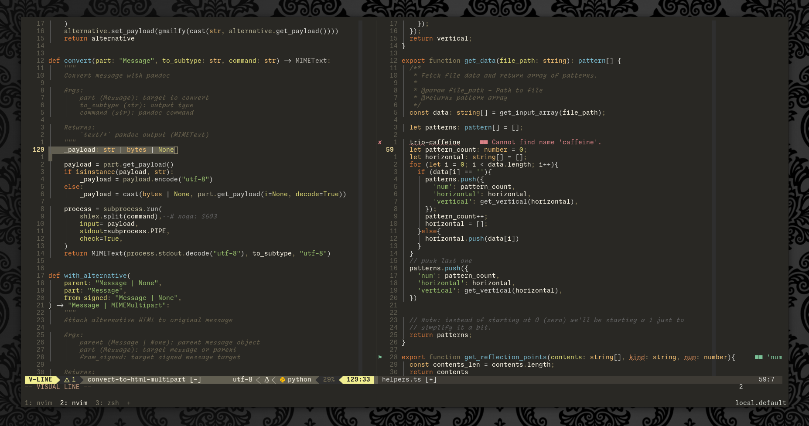

<!-- markdownlint-disable MD033 MD041 -->
<div align="center">

# Trio-Caffeine

[](https://neovim.io/)
[](https://www.lua.org/)

</div>

This is the third iteration of my personal colorscheme, which is based
on the Atom syntax theme [no-caffeine-syntax](https://github.com/thomaslindstrom/no-caffeine-syntax).
It was shoddily transferred to Vim using a colorscheme called
`Duotone-DarkDesert` as a base and eventually cleaned up to become
`duo-caffeine`. Now it is reworked for Neovim.

**Note:** This is a work in progress.



## Plugins

* [nvim-treesitter](https://github.com/nvim-treesitter/nvim-treesitter)
* [telescope.nvim](https://github.com/nvim-telescope/telescope.nvim)
* [gitsigns.nvim](https://github.com/lewis6991/gitsigns.nvim)
* [render-markdown.nvim](https://github.com/MeanderingProgrammer/render-markdown.nvim)
* [dict-popup](https://github.com/Nealium/dict-popup.nvim) *(mine)*

## Install

* [Lazy.nvim](https://github.com/folke/lazy.nvim>)

```lua
{
    "Nealium/trio-caffeine.nvim",
    dependencies = { "nvim-treesitter/nvim-treesitter" },
    dev = true,
    lazy = false,
    priority = 999,
    config = function()
        require("trio-caffeine").setup()
    end,
    init = function()
        vim.cmd("colorscheme trio-caffeine")
    end,
}
```

## Sources

* Neovim base: [poimandres.nvim](https://github.com/olivercederborg/poimandres.nvim)
* Handy color tools: [name-that-color](https://chir.ag/projects/name-that-color/)
  \+ [color-name-hue](https://www.color-blindness.com/color-name-hue/)
